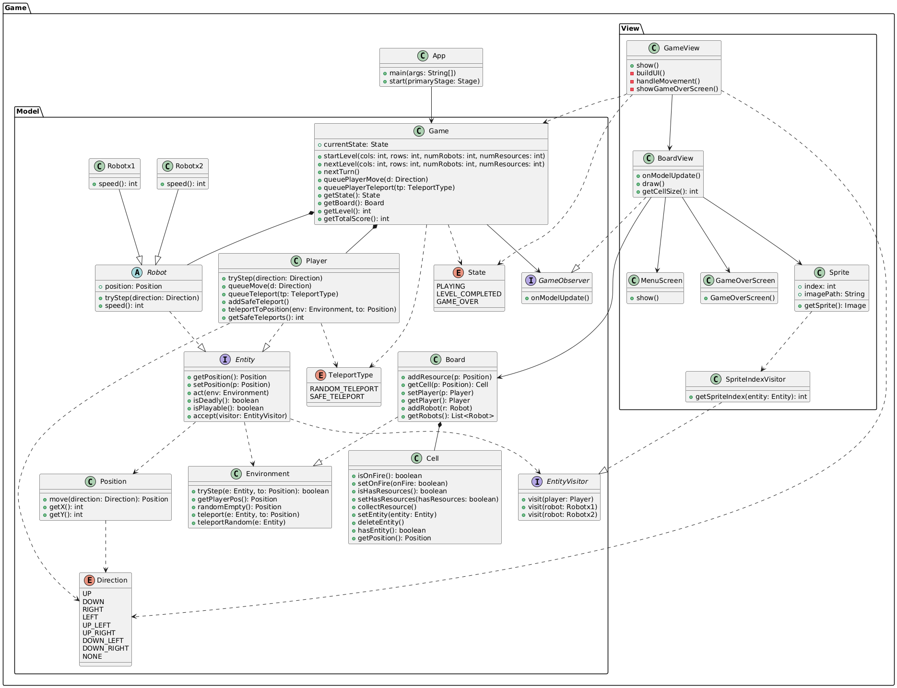

# Documentación del Diseño del Juego "Robots"

## Introducción

El juego "Robots" es un juego de estrategia y supervivencia en el que el jugador debe recoger recursos mientras evita ser atrapado por robots. Los elementos del juego están organizados en un tablero, y el jugador tiene la capacidad de moverse y teletransportarse para evitar peligros. Este diseño promueve la interacción fluida entre las entidades del juego, equilibrando la lógica del juego y su representación visual.

## Esquema UML

## Estructura del Proyecto

El proyecto está estructurado en dos paquetes principales:

- **game.Model**: Contiene la lógica del juego, incluyendo entidades, comportamientos y reglas.
- **game.View**: Maneja la representación visual del juego y la interacción del usuario.

## Clases en `game.Model`

### 1. **Entity**
Interfaz que define métodos esenciales para todas las entidades del juego (jugador y robots). Proporciona métodos vitales que permiten una interacción coherente con el entorno, facilitando la extensión y el mantenimiento del sistema.

### 2. **Player**
Mediante esta clase, el jugador interactúa con el tablero, proporcionando métodos para moverse y teletransportarse. Además, gestiona acciones en cola, lo que permite una experiencia de juego dinámica y estratégica.

### 3. **Robot**
Clase abstracta que establece un marco común para los diferentes tipos de robots en el juego, permitiendo implementar comportamientos variados. Facilita la adición de nuevos tipos de robots sin tener que reestructurar la lógica existente.

### 4. **Robotx1 y Robotx2**
Cada una de estas clases implementa un tipo específico de robot, proporcionando lógica de movimiento y comportamiento distintas. Esto enriquece la dinámica del juego al introducir variedad en los tipos de desafíos que enfrenta el jugador.

### 5. **Cell**
Representa cada celda del tablero y gestiona su estado (si contiene recursos, está en llamas, etc.). Su diseño encapsulado promueve la lógica interna y simplifica el acceso para otras clases.

### 6. **Board**
Actúa como la estructura organizativa que gestiona las celdas y coordina las interacciones en el espacio de juego. Además, mantiene el estado del juego y facilita la interacción entre diferentes entidades.

### 7. **Position**
Facilita la gestión de coordenadas en el tablero, ofreciendo métodos para calcular movimientos y distancias, simplificando así la lógica de interacción entre las entidades y el entorno de juego.

### 8. **Direction**
Enumeración que define direcciones posibles de movimiento. Mejora la legibilidad y simplifica la implementación de la lógica de desplazamiento para jugadores y robots.

### 9. **TeleportType**
Especifica los tipos de teletransporte disponibles para el jugador. Este diseño organiza las mecánicas de teleportación y permite su implementación flexible en el juego.

### 10. **Game**
Esta clase principal actúa como el coordinador del juego, gestionando el flujo de la partida, el inicio de niveles y las actualizaciones del estado general, permitiendo que el juego avance de manera controlada.

### 11. **GameObserver**
Interfaz que permite a varios componentes suscribirse a eventos del juego, facilitando la notificación de cambios de estado. Implementa el patrón Observador, promoviendo un diseño desacoplado y flexible.

### 12. **State**
Mantiene la información sobre el estado actual del juego (jugando, nivel completado, o juego terminado). Es clave para gestionar el ciclo de vida del juego y orientar las interacciones en diferentes fases.

### 13. **EntityVisitor**
Interfaz que hace uso el patrón Visitante, permitiendo que se realice una operación sobre las entidades del juego (como `Player`, `Robotx1`, y `Robotx2`) sin alterar sus estructuras. Facilita el acceso a las propiedades y comportamientos de las entidades a través de un solo punto, promoviendo la extensibilidad y el diseño limpio.

## Clases en `game.View`

### 1. **GameView**
Responsable de la interfaz gráfica, se encarga de representar visualmente el estado del juego. Separa la presentación de la lógica del juego, permitiendo cambios en la UI sin afectar la funcionalidad.

### 2. **MenuScreen**
Presenta el menú inicial y facilita opciones para que el usuario personalice su experiencia de juego. Su diseño se centra en la accesibilidad y la navegación intuitiva.

### 3. **GameOverScreen**
Se muestra al final de la partida, ofreciendo opciones para reiniciar. Centraliza la lógica relacionada con el final del juego, manteniendo la modularidad en su implementación.

### 4. **BoardView**
Dibuja el tablero y los elementos en él, utilizando un `Canvas` para permitir actualizaciones rápidas en la visualización. Este diseño asegura que la interacción con el entorno sea fluida y visualmente clara.

### 5. **Sprite**
Gestiona la animación de las entidades, abstrae la lógica necesaria para mostrar las acciones de manera fluida y eficiente, garantizando que el movimiento y la representación visual sean consistentes.

### 6. **SpriteIndexVisitor**
Implementa `EntityVisitor`, permitiendo obtener el índice de un sprite basado en la entidad pasada. Este enfoque promueve la separación de la lógica de acceso a datos de la lógica de juego.